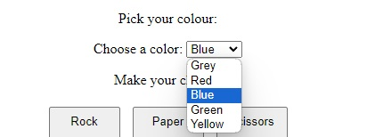
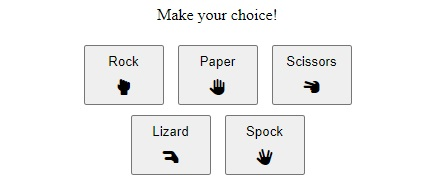
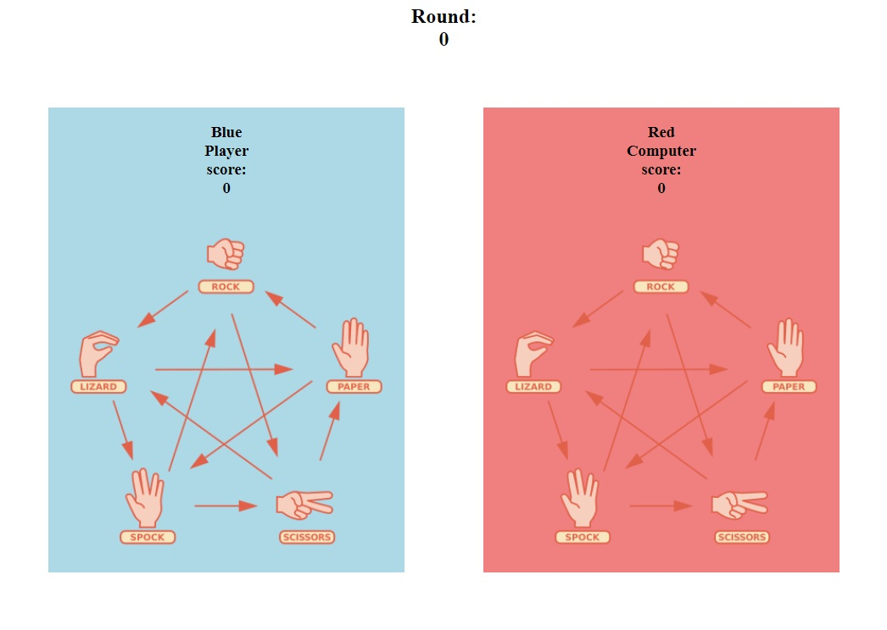
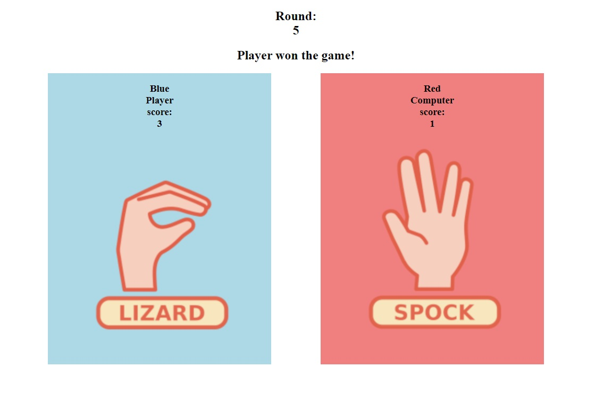
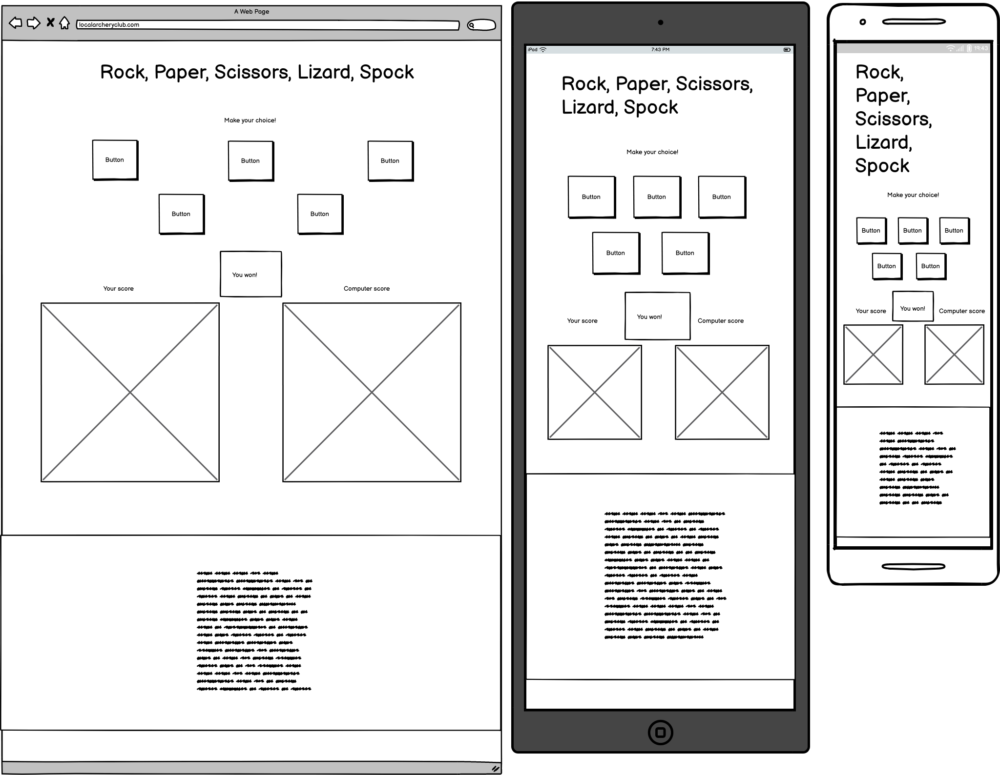

[View the site live here!](https://masorr.github.io/rock-paper-scissors-lizard-spock/)

# Rock, Paper, Scissors, Lizard, Spock

Rock, Paper, Scissors, Lizard, Spock (shortened RPSLS) is an advanced game of the classic Rock, Paper and Scissors game. Each choice has the ability to 'beat' two other choices. For example in RPSLS: Rock beats Scissors but also Lizard. This is unlike RPS: where one choice beats another (example: Rock beats Scissors).

The game will put the player against the computer in a game of 5 rounds so that the player can become more familiar with this advanced type of RPS. The computer's choice is completely random, therefore the game's results are completely random: making it a 'fair' game. May the luckiest player (or computer) win!

Users of this game will learn the rules of RPSLS, and is targeted towards adults and children alike to learn a more complex game that they can later have fun with and play with each other.

## Features

### Existing Features

- **Header**

  - Featured at the top of the page and easy to read. The header clearly explains what game it is that they are playing.

- **Player Customization**

  - Featured right below the header. The user is allowed to customize the colour of their 'player character' from a predetermined colour set in the form of a drop-down list.
  - The chosen colour of the user will appear in their player-box, above their name and also change the box to the chosen colour.
  - Upon user selection of their colour, the computer will also choose its own colour, and change the colour of its box to its chosen colour.
  - The computer will never choose the same colour as the player currently uses. This is to prevent confusion and keeping an easy visual distinction between each player.
  - The customized colour choices are locally stored in the browser. Keeping the user's and computer's preferred colour if the page is refreshed or if the user close it and would decide to come back.

- **Game Options**

  - The user is presented with 5 clickable options in the game: Rock, Paper, Scissors, Lizard or Spock. Each of these clickable buttons contain a text presenting their choice and also contain a corresponding icon for better style and easier visualisation of each choice.
  - When a button is clicked. The buttons will be locked until the computer has made its own move against the player. This makes it more user friendly to the player as it will prevent clicking two buttons or more in succession by mistake.

- **Game Results**

  - The game will start at round 0 and end at round 5.
  - The user's box on the left side will change image when the user clicks on one of the game buttons. It will change to an appropriate picture presenting the player's choice.
  - The computer's image will turn blank with a delay to portray a more human behaviour. Conveying a feeling that it is 'thinking about its next move'.
  - The computer's JavaScript coding will make a completely random choice between Rock, Paper, Scissors, Lizard or Spock. It will change its image to its choice and then the game will decide who the winner is of the round.
  - When the round's winner is decided (or if it's a tie) the round will increase by 1, and if there is a winner they will be awarded 1 point more to their score.
  - At the end of round 5, a description of the game's result will be displayed between the game buttons and game profiles: revealing the winner of the game (or if it's a tie).
  - After round 5, the game will immediately restart if the player clicks on any game button. The game will also immediately begin through round 1, sending the player and computer straight into the game and deciding who the winner is of round 1.

- **The Footer**

  - The footer contains the rules for the game presented as easily readable text with supporting icons.

### Features Left to Implement

- Allow the player to choose a username. Give the player the ability to choose their username (player name) name and not only a customized colour.
- **Reasons**: Lack of time.

- Give different coloured computers personalities or even difficulties (not completely random but based also on player's actual choice). Personalities will be displayed by a text above the computer's image commenting on the player on for example: winning or loosing.
  - Example: Grey Computer might be snarky and say "Maybe I have an algorithm that makes me win over you?" and "Not weird that the computer wins at a computer game."
  - Yellow might be kind and say "I hoped you would win! Congrats!" and "Well played (username)!"
  - Red might be a sore loser and say "It's all about luck anyway!" and "I demand a rematch!"
- Make the computer do a 'smiley' based on its personality when it wins and looses after each round and at the end of the game, to give more humour and liveliness to the game.
  - Example: Yellow might do happy smiley when the player wins and a sad smiley (or neutral smiley) when it wins over the player (since it has a 'kind' personality).
  - Red might do a sad smiley when the player wins and a happy smiley when it wins over the player.
- Each computer personality might have a different delay on its choices. To further increase their 'personalities' by giving the impression that some are 'fast thinkers' and others are slower.
- **Reasons**: Lack of time.

- Make icon shake (or some form of animation) in the game buttons upon being clicked.
- **Reasons**: Lack of time.

- Make the icon appear of the chosen option as a shaking or animated icon above each competitors image.
- **Reasons**: Lack of time. Might actually not be implemented as it might not be authentically pleasing (can contribute to a feeling of being 'too much').

- Historical moves area, showing what choices has been made by both player and computer.
- **Reasons**: Lack of time.

- Area showing favourite choice and favourite combination for both player and computer.
  - Example: "Player's favourite option: Paper" and "Player's favourite combination: Lizard, then Rock".
- **Reasons**: Lack of time.

- Worst enemy. The player will have a 'Worst Enemy' which will be the coloured computer they have lost the most times against. Based on at least 3 games.
  - Example: In 7 games. The player has won 2 times against Blue Computer, lost 1 against Green Computer, won 1 against Yellow Computer, lost 4 times against Yellow Computer.
  - Worst Enemy: Yellow Computer (since the player has lost 4/5 games against Yellow Computer, and it is more total played games than 1/1 against Green Computer)
- **Reasons**: Lack of time.
  
- Easiest enemy. The player will have a text declaring which coloured enemy computer they are winning the most against. Based on at least 3 games.
  - Example: In 9 games. Player has won 3 times against Grey Computer, lost 2 times against Grey Computer, won 3 times against Red Computer.
  - Easiest Enemy: Red Computer (since the player has won 3/3 of the games against this computer, and it is at least 3 games in total, compared to the 4/5 times against Grey Computer)
- **Reasons**: Lack of time.

- Circulating between opponents. At the end of each game, the player will face either the same or a different coloured computer.
  - Example: Player wins over Red Computer. Next game the player will be randomly put against one of the potentially coloured computers, it might be anyone. Might be Red again, or it might be Yellow or Blue.
- **Reasons**: Lack of time.

## Design

- **Wireframes**

  - The initial game page wireframe.
    

- **Wireframe / End Design Likeness**

  - Game page

    - 'You won!' div does not have a border or styling as could be suggested by the wireframe.
    - Buttons have consistent spacing between each other. They don't change based on screen media.
    - **Reasons**: Didn't feel iike they were necessary. Keeping it simple. Better design.

- **Colours**

  - The presented colour names in the game are not the actual semantic colours in the game.
   - "Red" for example is actually "lightcoral" and "Yellow" is actually "lightgoldenrodyellow".
  - **Reasons**: Better UX. These colours are lighter in nature, making the texts and images easier to read visualize. The actual names of the colours are somewhat unfriendly, so they were changed to more appropriate names when presented for the user.

  - Footer has inverted colours. Its background is black while the text is white.
  - **Reasons**: Better UX. To make the rules clearly separated from the rest of the document.

- **Style**

   - All 5 options that are playable in the game: all 5 are represented by both literal text and an illustration or icon.
   - **Reasons**: Consistency. Clearly associating what (image)/(hand gesture) are associated with what literal choice. Making the game easier to read and learn.

## Testing

### Manual Testing

### Validator Testing

- HTML
  - No errors or warnings were returned on any of the html pages when passing through the html validator: <https://validator.w3.org/#validate_by_input>
- CSS

  - No errors were found when passing through the css validator: <https://jigsaw.w3.org/css-validator/>

- HTML validator results for index.html, about.html, contact.html and confirmation.html
  

- CSS validator result for style.css
  

### Media

- Tested on Microsoft Edge, Mozilla Firefox and Chrome.
- Chrome development tools were used through the process of checking and configuring responsiveness. Adjustments were made accordingly.
- Screen media mockup tested on <https://ui.dev/amiresponsive?url=https://masorr.github.io/local-archery-club/>
- Tested by changing sizes on browser tabs.
- Tested on desktop, laptop and mobile.

### Lighthouse Testing

- Home page

  

- About page

  

- Contact page

  

- Confirmation page

  

### Fixed Bugs

- Media screen when max-width go below 760px, menu jumps down below logo. However the menu is reversed, beginning with contact about home instead of home about contact.

  - Bug was fixed when using px instead of % in width for paddings and margins.

- Send button on form is clickable only on 'Send!' text instead of the whole button.
  - Bug wasn't encounterable when checking last time. Uncertain how it was fixed.

### Unfixed Bugs

- There are no known unfixed bugs.

## Deployment

- The site was deployed to GitHub pages through following steps:
  - On the repository page, go to 'Settings' in navbar. <https://github.com/Masorr/local-archery-club> --> <https://github.com/Masorr/local-archery-club/settings>
  - In settings go to 'Pages' under 'Code and automation' on the left. <https://github.com/Masorr/local-archery-club/settings/pages>
  - Select main branch and hit 'Save'.
  - Refresh page and hit 'Visit site' on the new 'Your site is live at' box to view the successful deployment.

Link to live site - <https://masorr.github.io/local-archery-club/>

- Cloning the Repository:
  - On the repository page, click the 'Code' box.
  - Pick local then HTTPS and copy the link that is shown, which is: <https://github.com/Masorr/local-archery-club.git>
  - Open the terminal in your code editor and specify the directory you want to have your clone.
  - Type 'git clone' into your terminal and paste the link <https://github.com/Masorr/local-archery-club.git> and hit enter.

## Credits

### Content

- HTML, CSS, layout, structuring and understanding of concepts was made with the help by the course material from Code Institute and inspired particularly by the Love Running project.
- HTML form and CSS for the form in contact was taken from Love Running project at the Code Institute program. Some attributes and elements have been changed but it has been used as the template.
- All icons were taken from <https://fontawesome.com/>
- In CSS the code concept for styling with flex display 'display: flex' and 'justify-content: center' for centering images on about page came from <https://blog.hubspot.com/website/center-an-image-in-html>
- In CSS the 'flex-wrap: flex' came from <https://css-tricks.com/snippets/css/a-guide-to-flexbox/>
- README template was copied from Love Running Project given by Code Institute.

### Media

- All images were taken from pexels.com <https://www.pexels.com/>
  - images by Mikhail Nilov <https://www.pexels.com/@mikhail-nilov/>
    - file:///workspaces/local-archery-club/assets/images/pex-mn-young-male.jpg
    - file:///workspaces/local-archery-club/assets/images/pex-mn-wheelchair-archer.jpg
    - file:///workspaces/local-archery-club/assets/images/pex-mn-wheelchair-archer-smile.jpg
    - file:///workspaces/local-archery-club/assets/images/pex-mn-instructor.jpg
    - file:///workspaces/local-archery-club/assets/images/pex-mn-hands.jpg
  - images by RDNE Stock project <https://www.pexels.com/@rdne/>
    - file:///workspaces/local-archery-club/assets/images/pex-rsp-experienced-archer.jpg
    - file:///workspaces/local-archery-club/assets/images/pex-rsp-children.jpg
    - file:///workspaces/local-archery-club/assets/images/pex-rsp-child-and-adults.jpg
    - file:///workspaces/local-archery-club/assets/images/pex-rsp-bows.jpg

## Thanks

s

- I want to thank Code Institute and their tutors for their program and lessons, and giving me the opportunity to navigate and learn by myself by coding this webpage.
- I want to thank the Slack community and my mentor Dick Vlaanderen for feedback and inputs.
