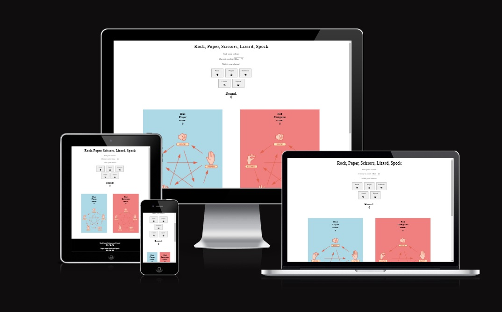
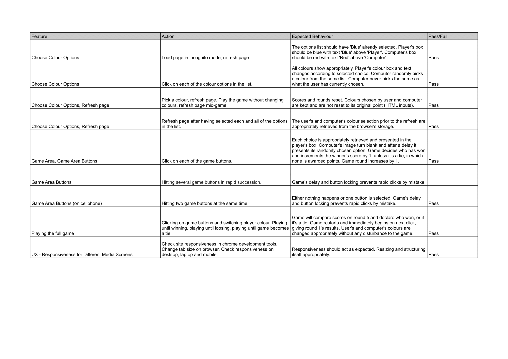

[View the site live here!]()

# Rock, Paper, Scissors, Lizard, Spock

Rock, Paper, Scissors, Lizard, Spock (shortened RPSLS) is an advanced game of the classic Rock, Paper and Scissors game. Each choice has the ability to 'beat' two other choices. For example in RPSLS: Rock beats Scissors but also Lizard. This is unlike RPS: where one choice beats another (example: Rock beats Scissors).

The game will put the player against the computer in a game of 5 rounds so that the player can become more familiar with this advanced type of RPS. The computer's choice is completely random, therefore the game's results are completely random: making it a 'fair' game. May the luckiest player (or computer) win!

Users of this game will learn the rules of RPSLS, and is targeted towards adults and children alike to learn a more complex game that they can later have fun with and play with each other.

## Features

### Existing Features

- **Navigation Bar**

  - Featured on all three pages (and fourth hidden which is confirmation.html). Fully responsive and includes links to logo, home, about and contact and is the same on each page for easy navigation.
  - Section allows user to easily navigate on all devices without the necessity of using the 'back' button.

- **The landing page image**

  - The first image show a child and several adults exercising archery. Meant to be attractive for beginners, showing people of all ages and showing a social environment.

- **Home Sections**

  - The first part of the home sections explains core information. Beginning with that everyone is welcome.
  - The second image shows a young adult. Meant to reinforce that the club is also meant for adults.
  - Latter part of the home sections explains other core information. Beginning with information about newcomers. Then explaining what isn't allowed in the club and what it's meant for. Then finally showing pricing information.
  - The information is meant to be kept short and simple together with an accompanying image for easy reading.

- **Times Table Section**

  - This section is present on every page above the footer as an easy and simple reminder of what times the users can visit the club.
  - This section will be updated should the times change.

- **The Footer**

  - The footer section contains the number for the club as well as its address on the left side. It contains relevant social media for Local Archery Club on its right side with clickable icons for easily taking the user to respective site.
  - The footer encourages users to stay in contact with Local Archery Club's social media.

- **About landing page**

  - The first image on the about page replaces the hero image from the home page. This is a visual aid to inform the user that they are not on the home page.
  - The image shows a focused shot of a person wielding a bow and ready with an arrow. It's meant to summarise what the site is about: which is archery.

- **About section**

  - The about section explains more in detail who is the target audience.
  - It explains for which age group it's for, that it's for both new, experienced and those in between, that they can borrow or bring their own equipment, and that there are instructors present. It explains that they can also hang around and watch, sit, socialize and drink coffee or tea.
  - It shows a gallery to keep the viewer interested, to show what it's like on the range, and to visually represent some of what was written in the 'Freedom' heading. It shows an archer in a wheelchair, an image of an experienced archer, an image of an archer with an instructor, and an image of two children practicing archery.
  - The latter part in 'Straightforward' finishes up the section and encourages the user to visit their range.
  - The bottom of the section contains a clickable icon meant especially for beginners that takes the user to a tutorial on www.youtube.com.
  - The bottom of the section also contains an image of one of the archers from the image gallery, smiling towards the camera. Showing he's having fun and that he's likely a regular practicioner.

- **Contact**

  - This page allows the user to sign up to Local Archery Club. The user will be required to fill in their first name, last name and email address.
  - They're told that if they want, they can leave a message and there's a clickable 'call!' link which will take the user to the footer where the club's number is.
  - The message is optional, they can fill it in or leave it empty.

  

- **Confirmation**

  - This page will be loaded once the form on the contact page has successfully been sent. It confirms that the user's form has been sent and received.

### Features Left to Implement

- Add change language button next to logo. Since the page is meant to be a local club in sweden, original language should be swedish. Should be a simple button showing the flag of the country to inform which language the site is currently on.
- **Reasons**: Lack of time.

## Design

- **Wireframes**

  - The initial home page wireframe.
    
  - Initial about page wireframe.
    
  - Initial contact page wireframe.
    

- **Wireframe / End Design Likeness**

  - Home page

    - Image on right is taller, taking up the right space. Price heading is placed on left. No crossbows heading is added.
    - The uploaded image was taller than expected and formed the new idea of the end design, which result was more aesthetically pleasing.
    - **Reasons**: Better design, clarifying what's prohibited.

  - About page

    - Image gallery added.
    - Link to youtube tutorial and final image added.
    - **Reasons**: Suggested by mentor. Adds more information for what the club is about, and makes the page more attractive.

  - Contact page
    - Removed payments and questions paragraph between form and logo.
    - **Reasons**: Suggested by mentor. Not needed.

- **Colours**

  - Lightblue background is chosen because it is a relaxing/cool colour. Meant to instill calmness and evoking a "freedom of outdoors skyview" feeling.
  - Brown colour is chosen to give a natural and "woody" feeling.

## Testing

### Manual Testing

### Validator Testing

- HTML
  - No errors or warnings were returned on any of the html pages when passing through the html validator: <https://validator.w3.org/#validate_by_input>
- CSS

  - No errors were found when passing through the css validator: <https://jigsaw.w3.org/css-validator/>

- HTML validator results for index.html, about.html, contact.html and confirmation.html
  

- CSS validator result for style.css
  

### Media

- Tested on Microsoft Edge, Mozilla Firefox and Chrome.
- Chrome development tools were used through the process of checking and configuring responsiveness. Adjustments were made accordingly.
- Screen media mockup tested on <https://ui.dev/amiresponsive?url=https://masorr.github.io/local-archery-club/>
- Tested by changing sizes on browser tabs.
- Tested on desktop, laptop and mobile.

### Lighthouse Testing

- Home page

  

- About page

  

- Contact page

  

- Confirmation page

  

### Fixed Bugs

- Media screen when max-width go below 760px, menu jumps down below logo. However the menu is reversed, beginning with contact about home instead of home about contact.

  - Bug was fixed when using px instead of % in width for paddings and margins.

- Send button on form is clickable only on 'Send!' text instead of the whole button.
  - Bug wasn't encounterable when checking last time. Uncertain how it was fixed.

### Unfixed Bugs

- There are no known unfixed bugs.

## Deployment

- The site was deployed to GitHub pages through following steps:
  - On the repository page, go to 'Settings' in navbar. <https://github.com/Masorr/local-archery-club> --> <https://github.com/Masorr/local-archery-club/settings>
  - In settings go to 'Pages' under 'Code and automation' on the left. <https://github.com/Masorr/local-archery-club/settings/pages>
  - Select main branch and hit 'Save'.
  - Refresh page and hit 'Visit site' on the new 'Your site is live at' box to view the successful deployment.

Link to live site - <https://masorr.github.io/local-archery-club/>

- Cloning the Repository:
  - On the repository page, click the 'Code' box.
  - Pick local then HTTPS and copy the link that is shown, which is: <https://github.com/Masorr/local-archery-club.git>
  - Open the terminal in your code editor and specify the directory you want to have your clone.
  - Type 'git clone' into your terminal and paste the link <https://github.com/Masorr/local-archery-club.git> and hit enter.

## Credits

### Content

- HTML, CSS, layout, structuring and understanding of concepts was made with the help by the course material from Code Institute and inspired particularly by the Love Running project.
- HTML form and CSS for the form in contact was taken from Love Running project at the Code Institute program. Some attributes and elements have been changed but it has been used as the template.
- All icons were taken from <https://fontawesome.com/>
- In CSS the code concept for styling with flex display 'display: flex' and 'justify-content: center' for centering images on about page came from <https://blog.hubspot.com/website/center-an-image-in-html>
- In CSS the 'flex-wrap: flex' came from <https://css-tricks.com/snippets/css/a-guide-to-flexbox/>
- README template was copied from Love Running Project given by Code Institute.

### Media

- All images were taken from pexels.com <https://www.pexels.com/>
  - images by Mikhail Nilov <https://www.pexels.com/@mikhail-nilov/>
    - file:///workspaces/local-archery-club/assets/images/pex-mn-young-male.jpg
    - file:///workspaces/local-archery-club/assets/images/pex-mn-wheelchair-archer.jpg
    - file:///workspaces/local-archery-club/assets/images/pex-mn-wheelchair-archer-smile.jpg
    - file:///workspaces/local-archery-club/assets/images/pex-mn-instructor.jpg
    - file:///workspaces/local-archery-club/assets/images/pex-mn-hands.jpg
  - images by RDNE Stock project <https://www.pexels.com/@rdne/>
    - file:///workspaces/local-archery-club/assets/images/pex-rsp-experienced-archer.jpg
    - file:///workspaces/local-archery-club/assets/images/pex-rsp-children.jpg
    - file:///workspaces/local-archery-club/assets/images/pex-rsp-child-and-adults.jpg
    - file:///workspaces/local-archery-club/assets/images/pex-rsp-bows.jpg

## Thanks

s

- I want to thank Code Institute and their tutors for their program and lessons, and giving me the opportunity to navigate and learn by myself by coding this webpage.
- I want to thank the Slack community and my mentor Dick Vlaanderen for feedback and inputs.
